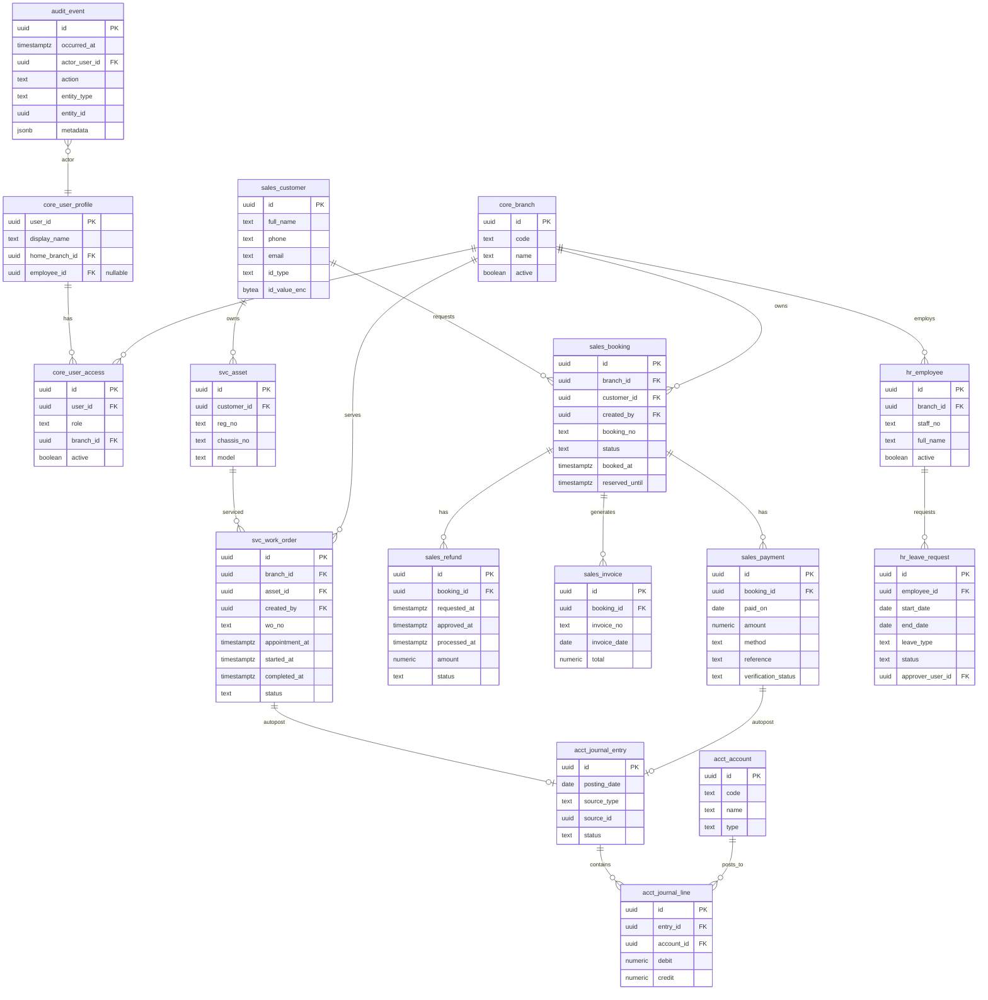
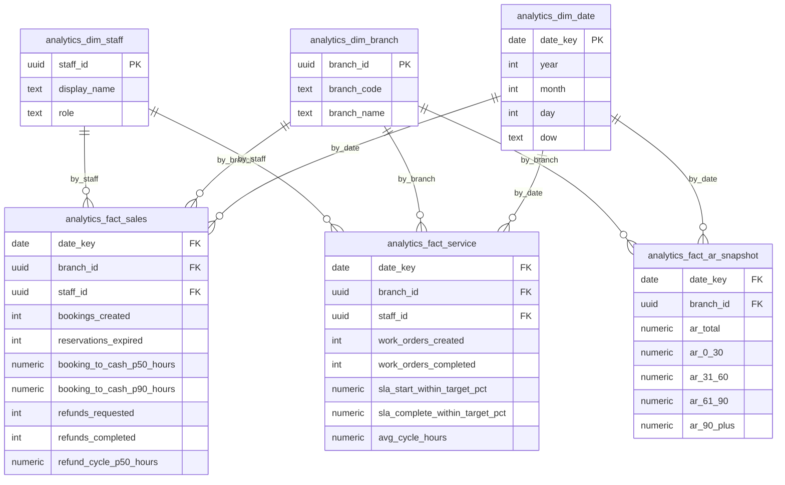
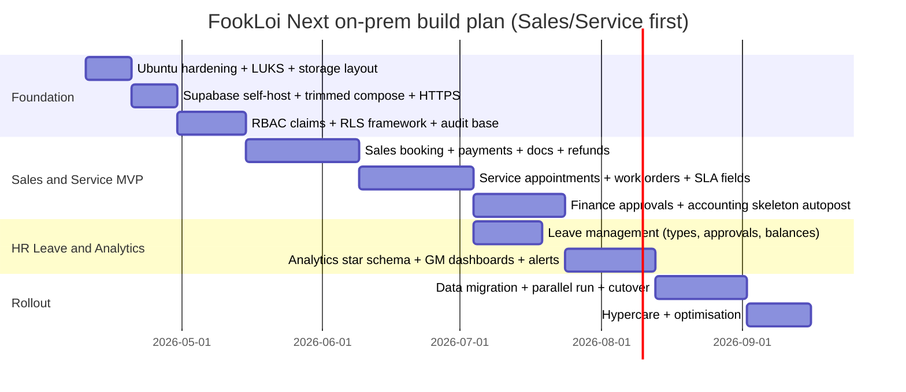

# FookLoi Next System Design for On‑Prem Ubuntu + Self‑Hosted Supabase  
Dated: 2026-04-08 (Asia/Kuching)

## Executive summary

This design turns the previously defined **FookLoi Next** PRD into an implementable **on‑prem Unified Business Suite** focused on **Sales + Service first**, with **HRMS limited to Leave Management (no payroll)**, backed by a **self‑hosted Supabase stack** on a single **Ubuntu Server (16GB RAM, Intel i3 9th Gen, NVMe SSD)**.

The design goals are to:  
Build a robust, secure “single source of truth” system on local infrastructure that a 4–6 person team can operate;  
Use Supabase “the right way” for an exposed API: isolate data by role/branch with **Postgres RLS** (Row Level Security) and **custom JWT claims**;  
Implement C‑level analytics (GM/Director dashboards) without leaking sensitive personal/HR data;  
Meet Malaysia PDPA obligations through **data minimisation, strong access controls, encryption at rest, audit logging, and breach readiness**.

Key technical anchors from primary documentation:  
Supabase self-hosting supports Docker and provides guidance on system requirements and trimming services; it explicitly notes you can remove services you don’t need to reduce resource requirements. citeturn0search0  
Supabase requires HTTPS for production self-hosted deployments and recommends a reverse proxy in front of the Supabase API gateway. citeturn6search2  
Supabase’s security posture expects RLS on exposed schemas, and its docs show patterns using `auth.uid()` / `auth.jwt()` in policies (including performance notes). citeturn1search0  
Supabase documents how to store custom claims in the user JWT and use them in RLS for RBAC. citeturn0search1  
Malaysia’s PDPA regulates personal data processing in commercial transactions and has seven core principles; the 2024 amendment introduces DPO appointment and breach notification duties. citeturn6search0turn6search1turn6search34turn0search3  

## Assumptions and scope boundaries

Because key details are unspecified, this design makes the following assumptions (and calls out where to refine later):

Assumed user scale: 20–60 internal staff total, with 10–25 concurrent sessions typical during business hours. (If higher, add a second node for HA sooner.)  
Assumed deployment model: single primary site (HQ), with optional branch connectivity via VPN and centralised database access.  
Assumed identity model: all internal users authenticate via Supabase Auth; customer portal is out-of-scope for “Sales/Service first” but can be added later.  
Assumed document needs: Sales receipts, invoices, service attachments, and HR leave attachments (MC/doctor letter) require object storage. Supabase Storage supports this and can be configured to use an S3-compatible backend such as MinIO. citeturn12search2turn4search1  

In-scope modules (prioritised):
Sales, Service, Admin (reference data), Finance (approvals + payment/refund workflows), Accounting skeleton (journals + AR/AP placeholder), HR Core (leave only).

Out of scope:
Payroll (explicitly excluded); complex ERP manufacturing/inventory; full customer-facing omnichannel CRM.

## Target architecture and local deployment design

### Component architecture

The architecture uses:  
A single internal webapp (with optional lightweight BFF),  
Supabase self-hosted (Postgres + Auth + PostgREST + Storage + Supavisor pooler),  
MinIO for S3-compatible object storage,  
Nginx reverse proxy for TLS termination and routing (required for production Supabase self-hosting). citeturn6search2turn4search6  

```mermaid
flowchart LR
  subgraph Users["Internal users (VPN/LAN)"]
    DS[Director of Service]
    GMS[GM Service]
    GMLS[GM Sales]
    AM[Accounting Manager]
    FM[Finance Manager]
    SA[Sales Admin]
    SM[Service Manager]
    SLM[Sales Manager]
  end

  subgraph Edge["Ubuntu Server (On-prem)"]
    NGINX[Nginx reverse proxy\nTLS + security headers]
    WEB[Unified Webapp\n(Next.js / Nuxt / SPA)]
    BFF[BFF / Integration API\n(Webhooks + service-role ops)]
    SUPA[Supabase Docker Compose\nKong + Auth + PostgREST + Storage + Supavisor]
    PG[(Postgres)]
    POOL[Supavisor pooler\n(transaction mode)]
    MINIO[(MinIO - S3 compatible storage)]
  end

  subgraph OptionalHybrid["Optional hybrid services"]
    OFFSITE[Offsite encrypted backups\n(S3/R2/B2)]
    EMAIL[Transactional email\n(SES)]
    SMS[SMS provider API\n(ESMS/iSMS/etc.)]
    WA[WhatsApp Cloud API\n(Meta Cloud API)]
    PAY[Payment gateways\n(Billplz/iPay88/FPX flow)]
  end

  Users -->|HTTPS| NGINX
  NGINX --> WEB
  WEB -->|API| SUPA
  WEB -->|webhooks| BFF
  BFF --> SUPA

  SUPA --> POOL --> PG
  SUPA --> MINIO

  BFF --> PAY
  BFF --> SMS
  BFF --> WA

  PG --> OFFSITE
  BFF --> EMAIL
```

Why this is appropriate for the given hardware:
Supabase’s self-hosting docs list recommended production baselines (8GB+ RAM, 4 cores+), and the target system (16GB RAM; i3 9th gen assumed 4 cores/threads depending on model) is above those general recommendations, but only if we trim non-essential containers and enforce connection pooling. citeturn0search0turn12search3  

### Supabase Docker Compose trimming strategy

Supabase explicitly recommends removing services you do not need (e.g., Analytics/Logflare, Realtime, imgproxy, Edge Runtime) from `docker-compose.yml` to reduce resource requirements. citeturn0search0  

For Sales/Service-first, recommended “keep vs disable”:

Keep in MVP:
Postgres (`db`), Auth (`gotrue`), PostgREST, Kong gateway, Storage, Supavisor pooler (default in the stack). citeturn12search3turn10view0  

Disable initially (unless a clear requirement emerges):
Realtime (subscriptions), Analytics/Logflare, imgproxy, Edge Functions runtime (if you use BFF instead). This reduces CPU/RAM and operational surface area. citeturn0search0turn10view3turn10view2  

### Reverse proxy and routing model

Supabase requires HTTPS for production self-hosted deployments and provides an official guide for adding a reverse proxy with HTTPS. citeturn6search2  
Nginx reverse proxy behaviour and header forwarding is documented by NGINX. citeturn4search6  

Routing recommendation:
`/` → Unified webapp  
`/supabase/` (or separate host `api.*`) → Supabase Kong (avoid exposing Studio publicly; restrict to admin IP/VPN)

### Storage architecture on NVMe with LUKS

Ubuntu documents full disk/partition encryption using LUKS at block level and supports encrypting an entire disk or a partition. citeturn2search6  

Recommended mount points (single NVMe, LUKS + LVM inside):
`/srv/fookloi/compose/` configs + secrets (root-only)  
`/srv/fookloi/postgres/data/` Postgres data  
`/srv/fookloi/postgres/wal/` WAL directory (optional split)  
`/srv/fookloi/minio/` MinIO data  
`/srv/fookloi/backups/` local encrypted backup staging

WAL placement:
Postgres docs state you can relocate `pg_wal` by moving the directory and creating a symlink while the server is shut down (useful to isolate WAL growth). citeturn12search1  

## Supabase schema, migrations, and ER design

### Schema strategy

Design principle:
Expose only what you must; enforce row-level access control at the database layer because PostgREST exposes tables directly and Supabase expects RLS for safe access. citeturn1search0  

Recommended schemas:
`core` (branches, user profiles, roles mapping)  
`sales` (bookings, reservations, invoices, payments, refunds)  
`svc` (service appointments, work orders, parts requests simplified)  
`hr` (leave only)  
`acct` (accounting skeleton: accounts + journal entries/lines + AR open items)  
`audit` (append-only audit events)  
`analytics` (star schema tables and/or materialised views)

### Core domain ER diagram



### Migration workflow and example SQL migrations

Supabase’s migrations guide shows creating migrations via CLI and storing SQL files in `supabase/migrations/`. citeturn6search3  

Recommended migration plan:
Create schemas and extensions first (pgcrypto, pg_stat_statements, pgaudit if supported in the image). pgcrypto is a “trusted” extension in Postgres docs and provides cryptographic functions. citeturn2search29  
Then create tables + indexes.  
Then enable RLS + add policies (treat “no policy” as “deny”). Supabase examples show enabling RLS and adding `select auth.uid()` wrappers for performance caching. citeturn1search0  

Example migration (sketch):

```sql
-- 20260408_0001_init.sql

create schema if not exists core;
create schema if not exists sales;
create schema if not exists svc;
create schema if not exists hr;
create schema if not exists acct;
create schema if not exists audit;
create schema if not exists analytics;

-- crypto + observability
create extension if not exists pgcrypto;
create extension if not exists pg_stat_statements;

-- core tables
create table core.branch (
  id uuid primary key default gen_random_uuid(),
  code text not null unique,
  name text not null,
  active boolean not null default true
);

create table core.user_profile (
  user_id uuid primary key,
  display_name text not null,
  home_branch_id uuid references core.branch(id),
  employee_id uuid null,
  created_at timestamptz not null default now()
);

create table core.user_access (
  id uuid primary key default gen_random_uuid(),
  user_id uuid not null references core.user_profile(user_id),
  role text not null,
  branch_id uuid not null references core.branch(id),
  active boolean not null default true,
  unique (user_id, role, branch_id)
);

-- Sales example
create table sales.booking (
  id uuid primary key default gen_random_uuid(),
  branch_id uuid not null references core.branch(id),
  customer_id uuid not null,
  created_by uuid not null,
  booking_no text not null unique,
  status text not null,
  booked_at timestamptz not null default now(),
  reserved_until timestamptz null
);

alter table sales.booking enable row level security;
```

Example RLS policy using custom JWT claims (pattern-only):

```sql
-- role + branch scoping using custom claims
create policy booking_select_by_scope
on sales.booking
for select
to authenticated
using (
  (select auth.jwt() ->> 'role') in ('gm_sales','sales_manager','sales_admin','finance_manager','accounting_manager')
  and branch_id = any ( (select (auth.jwt() -> 'branch_ids')::uuid[]) )
);
```

Why this pattern:
Supabase’s RLS docs explicitly support `auth.uid()` and `auth.jwt()` in policies and highlight using a subselect wrapper to let Postgres cache results per statement. citeturn1search0  

## RBAC, RLS mapping, and security & PDPA controls

### RBAC roles and access intent

Named roles: Director of Service, GM Service, GM Sales, Accounting Manager, Finance Manager, Sales Admin, Service Manager, Sales Manager.

High-level permission intent:
Sales roles manage bookings, quotes, reservations, customer interactions (within branch scope).  
Service roles manage appointments and work orders (within branch scope).  
Finance Manager approves refunds and high-risk changes; Accounting Manager owns journals/period close.  
GMs/Director have cross-branch analytics visibility (scoped to their business line), but not unrestricted access to HR personal data.

### How RBAC maps to Supabase custom JWT claims + RLS

Supabase’s RBAC guide shows adding custom claims into a user’s JWT (e.g., a `user_role`) and using that claim in RLS policies. citeturn0search1  

Recommended claims (minimum viable):
`role`: single primary role string (for UI gating and default RLS)  
`branch_ids`: array of UUID(s) user can access  
`capabilities`: optional array (e.g., `refund.approve`, `journals.post`) for fine-grained exceptions  
`line_of_business`: `sales` / `service` / `finance` / `accounting` (for analytics scoping)

Operational approach:
Store authoritative access control in `core.user_access` table.  
Issue tokens with claims computed from that table.  
Enforce row access via RLS using `auth.jwt()` and branch columns.

### MFA requirements

Supabase provides TOTP MFA docs, describing enrollment/challenge/verify flows and positioning MFA as best practice. citeturn1search1turn1search17  

Design requirement:
Enforce MFA for: Finance Manager, Accounting Manager, GM roles, Director of Service.  
Optionally require MFA for Sales Admin as they handle customer identities and payments.

### PDPA controls and breach readiness

PDPA objective:
Regulates processing of personal data in commercial transactions and protects data subjects. citeturn6search0turn6search8  
PDPA principles:
JPDP lists seven PDPA principles to maintain integrity of personal data. citeturn6search1  

Amendment (A1727):
Introduces DPO appointment obligations (section 12a) and breach notification requirements to data subjects where significant harm is likely (section 12b). citeturn6search34turn0search3  

Concrete technical + process controls:

Encryption at rest:
Use LUKS for disk/partition encryption on Ubuntu, which encrypts at block level. citeturn2search6  

Field-level encryption:
Use Postgres `pgcrypto` to encrypt fields like NRIC/passport, bank account fragments, and HR leave attachments metadata if needed. Postgres documents pgcrypto and its cryptographic functions. citeturn2search29  

Audit logging:
Use `audit.audit_event` table via application triggers + consider Postgres audit extension pgAudit for detailed audit logging through standard Postgres logging facilities. citeturn2search3turn2search7  

Breach playbook mapping to A1727:
Detect → contain → assess harm → notify Commissioner → notify affected subjects where required; implement “evidence pack” exports (audit logs, affected records, timelines) to support 12b process. citeturn0search3turn6search34  

Data minimisation and retention:
Only collect/store fields required for Sales/Service operations; retain attachments only as long as needed for business/legal purposes; rotate and purge. This aligns to the PDPA principles and reduces breach impact. citeturn6search1turn6search0  

## C-level analytics design: KPIs, dashboards, and star schema

### KPI definitions and why they matter

These KPIs directly reflect Sales/Service operational outcomes and control weaknesses (cash cycle, refunds, SLA adherence). They are computed from timestamped events to avoid subjective “manual reporting”.

Booking-to-cash cycle time:
`first_verified_payment_at - booked_at` (median/p90) per branch/advisor.  
Reservation expiry rate:
`expired_reservations / total_reservations`, plus ageing buckets by days.  
Refund cycle time:
`processed_at - requested_at` and `approved_at - requested_at`.  
Receivables ageing (Accounting skeleton):
AR open items bucketed by days outstanding (0–30, 31–60, 61–90, 90+).  
Service SLA:
Percentage of work orders started within X minutes of appointment and completed within target hours; compute from `appointment_at`, `started_at`, `completed_at`.

### Analytics architecture approach

Because this is single-node on-prem, the simplest reliable approach is:
Write clean operational events into OLTP tables.  
Maintain an `analytics` schema with star schema fact tables refreshed on schedule (hourly/daily), using SQL jobs executed by a local cron container or system cron calling `psql`.  
Avoid creating RLS-bypassing views for analytics without controls—Supabase warns that views can bypass RLS by default due to Postgres security definer behaviour. citeturn1search0  

### Analytics star schema (mermaid)



### Dashboard wireframe suggestions (text-first)

GM Sales dashboard:
Top row KPI cards: Bookings (today/MTD), Booking-to-cash p50/p90, Expired reservations, Refund cycle p50.  
Trend charts: bookings/day, deposit verification lag, expiries/day (stacked by branch).  
Drill-down: advisor leaderboard with filters (branch, model, week).

GM Service / Director of Service dashboard:
SLA cards: % started within target, % completed within target, avg cycle time, backlog > 24h.  
Heatmap by hour/day: appointment adherence.  
Top delay reasons: parts pending, approval pending, customer no-show (requires reason codes in work order status events).

Accounting/Finance dashboard:
AR ageing bar chart; refunds pending approvals; payment reconciliation exceptions.

### KPI alerting

Prometheus alerting rules are configured using PromQL expressions and can notify external systems. citeturn5search2  
Grafana supports Prometheus as a data source without requiring additional plugins. citeturn5search3  

Practical alert examples (implement via SQL-exporter or app metrics):
Reservation expiry spike: if `reservations_expired_today > threshold`.  
Refund backlog: `pending_refunds > N` for > 2h.  
Service SLA breach: `sla_start_within_target_pct < 80%` for > 1d.

## Operations runbook: performance tuning, backup/restore, monitoring, and integrations

### Postgres performance tuning (starting point for 16GB RAM)

Postgres notes that allocating more than ~40% RAM to `shared_buffers` is unlikely to work better because Postgres also relies on OS cache; and large `shared_buffers` typically require increasing `max_wal_size`. citeturn0search2  

Suggested `postgresql.conf` baseline (tune after observing workload):
```conf
shared_buffers = 4GB
effective_cache_size = 10GB
work_mem = 16MB
maintenance_work_mem = 512MB

max_connections = 200

checkpoint_timeout = 15min
checkpoint_completion_target = 0.9
max_wal_size = 8GB
min_wal_size = 2GB

log_min_duration_statement = 500ms
log_checkpoints = on
log_connections = on
log_disconnections = on
```

Checkpoint trade-off:
Postgres WAL configuration docs state that reducing `checkpoint_timeout` and/or `max_wal_size` causes more frequent checkpoints (faster crash recovery) but increases the cost of flushing dirty pages more often, so you must balance performance and recovery. citeturn5search1  

### Connection pooling: Supavisor first, PgBouncer optional

Supabase self-host Docker stack includes the Supavisor connection pooler by default and documents using it to access Postgres and manage database connections. citeturn12search3turn10view0  
Supavisor is an open-source Supabase pooler designed for scalable connection management. citeturn1search14turn1search18  

Recommendation:
Use Supavisor transaction pooling for webapp + PostgREST and integration workers; keep direct connections only for admin tasks.

Optional PgBouncer:
PgBouncer configuration docs describe connection pooling options and are useful if you need a simpler “classic” pooler in front of Postgres. citeturn0search2turn10view0  

Example `pgbouncer.ini` sketch:
```ini
[databases]
fookloi = host=127.0.0.1 port=5432 dbname=fookloi

[pgbouncer]
listen_addr = 0.0.0.0
listen_port = 6432
pool_mode = transaction
max_client_conn = 1000
default_pool_size = 50
ignore_startup_parameters = extra_float_digits
```

### Object storage: MinIO + Supabase Storage S3 backend

Supabase Storage is compatible with the S3 protocol and can be configured to use an S3-compatible backend. citeturn4search0turn12search2  
MinIO is explicitly positioned as a high-performance S3-compatible object storage solution. citeturn4search1  

Reasoning:
Receipts, invoices, and leave attachments should not live as base64 blobs in OLTP tables; object storage is more scalable, and S3 compatibility keeps future migration options open.

### Backups and restore strategy

Postgres documents three fundamental backup approaches: SQL dump, filesystem-level backup, and continuous archiving (WAL). citeturn2search0  
Postgres PITR documentation explains enabling WAL archiving (`wal_level`, `archive_mode`, `archive_command`) and the need for `restore_command` during recovery. citeturn5search0  

Recommended policy (single-node on-prem):
Daily `pg_dump -Fc` logical backups for fast selective restore.  
Weekly `pg_basebackup` physical backup for faster full restore.  
Optional WAL archiving (PITR) if RPO < 24h is required (adds operational complexity, but reduces data loss window). citeturn5search0turn5search1  

### Monitoring/logging stack

Query performance:
Enable `pg_stat_statements` to track statement statistics; Postgres docs describe enabling it via `CREATE EXTENSION` and using the `pg_stat_statements` views. citeturn1search3  

Audit:
Use pgAudit for “detailed session and/or object audit logging via standard PostgreSQL logging facility”. citeturn2search3turn2search7  

Logs:
Grafana Loki is an open-source logging stack designed to be cost-effective by indexing labels (metadata) and storing compressed chunks. citeturn11search0turn11search12  
Vector is an observability pipeline that supports logs and metrics and can ship logs to Loki. citeturn11search2turn11search10  

Metrics + dashboards:
Prometheus alerting rules are part of Prometheus configuration and allow defining alert conditions. citeturn5search2  
Grafana has native Prometheus support as a data source. citeturn5search3  

### Integration points (Sales/Service first)

Payments:
Billplz API is REST-based and returns JSON; supports sending bills and collecting payments. citeturn3search0  
iPay88 provides APIs for initiating payment; hosted-redirect flow keeps sensitive payment details on gateway servers (preferred to reduce scope). citeturn3search5turn3search13  
PayNet FPX B2C flow describes the merchant sending messages to FPX over SSL/TLS and redirecting buyers to banks; PayNet docs also note TLS requirements. citeturn3search14turn3search22  

WhatsApp:
WhatsApp Cloud API quickstart notes you can send messages via Meta-hosted Cloud API and inbound requires webhooks. citeturn3search7  

SMS (local providers, pluggable interface):
ESMS Malaysia states you can connect via API or use their portal. citeturn7search0  
iSMS Malaysia provides SMS gateway API integration offering automation into websites/apps. citeturn7search15  
SMSWORKS provides an official HTTP API guide for GET/POST submissions (PDF). citeturn7search19  

Design pattern for integrations:
Use an “outbox table” (`integration_outbox`) + idempotency keys + webhook handler to prevent double-processing (especially for payments and message delivery receipts). This reduces financial reconciliation risk.

## Roadmap and cost model summary

### Delivery milestones for a 4–6 person team



### Cost model (local + optional hybrid)

Local infra costs depend on the SSD size, UPS, backup disks, and power; these are site-specific and should be priced locally.

Optional hybrid costs (typical useful add-ons):
Cloudflare plans for CDN/WAF have published plan tiers. citeturn8search1  
AWS SES publishes email sending pricing ($0.10 per 1,000 outbound emails as a base). citeturn8search0  
Cloudflare R2 publishes R2 pricing; use it primarily for offsite backup targets and to avoid egress surprises in some architectures. citeturn7search2  
Backblaze B2 pricing resources are published in Backblaze help and transaction pricing pages; use it for offsite encrypted backups (especially cost-efficient storage). citeturn8search3turn8search15  

### Buy vs build: HR leave module

| Option | Pros | Cons | Recommendation |
|---|---|---|---|
| Build leave module inside FookLoi Next | Perfect RBAC integration; branch/role approvals; unified analytics | Requires careful policy design and testing but bounded scope | **Recommended** (leave-only is a safe, contained build) |
| Integrate existing HR system for leave | Faster if HR system already owned | Integration complexity and duplicated user/role sources | Consider only if HR system is already in place |
| Use generic ticketing for leave (Service-style tickets) | Fastest MVP | Poor HR reporting and balances; messy approvals | Not recommended beyond pilot |

Reasoning:
Leave management without payroll is relatively stable compared to statutory payroll logic; it’s feasible for a small team to build and keep accurate while maintaining PDPA controls and audit logs.

---

If you want the next design step, I can turn this into an implementation-ready “Build Pack” consisting of:  
a full SQL migration set (schemas, indexes, triggers, RLS policies),  
a trimmed `docker-compose.yml` overlay for Supabase + MinIO + Nginx,  
and a role-by-role screen map with JSON schemas for each form and validation rules.